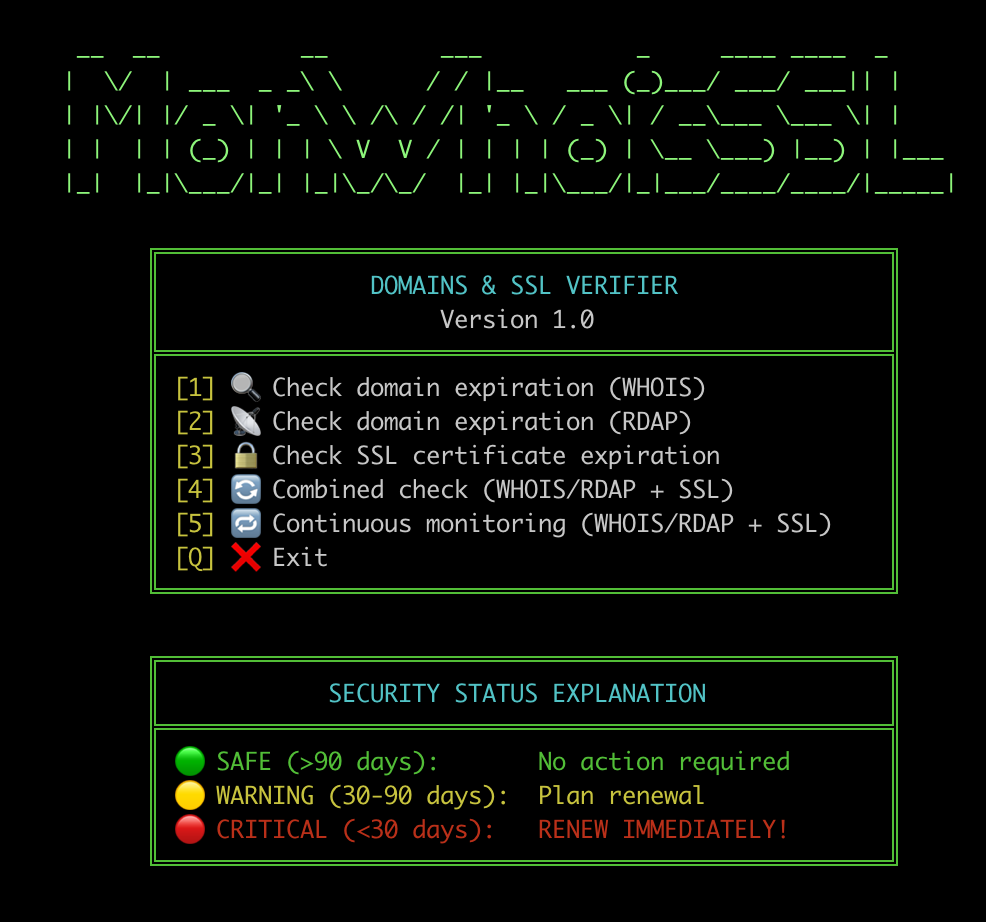

# MonWhoisSSL

Terminal-based domain expiration and SSL certificate monitor with an interactive menu and colored output.




## 📋 Features

- ✅ **Domain expiration lookup** via WHOIS
- ✅ **Domain expiration lookup** via RDAP (with automatic ARIN fallback and per-TLD server selection)
- ✅ **SSL certificate expiration check** via a direct TLS handshake
- ✅ **Combined check**: WHOIS/RDAP + SSL in one pass, prioritizing WHOIS and falling back to RDAP
- ✅ **Continuous monitoring** every 8 hours, with CONTROL-R to force an immediate check
- ✅ **DNS pre-check** in parallel for every domain, before spending time on WHOIS/RDAP/SSL
- ✅ **Threaded batch verification**: WHOIS, RDAP and SSL run concurrently for all domains
- ✅ **Color-coded status**: 🟢 Safe (>90 days), 🟡 Warning (30-90 days), 🔴 Critical (<30 days)
- ✅ **4-column results matrix**, dynamically sized to the terminal width
- ✅ **Live integrity check** of `domains.txt` during continuous monitoring (aborts if the file changes mid-run)

## 🚀 Installation

### Requirements

- Python 3.8 or higher
- `pip` (comes bundled with Python)
- System tools: `whois`, `curl`, `jq`
- Python dependencies: `requests` and `colorama`
- A terminal with ANSI color support (any modern terminal on macOS/Linux)

### macOS

Install the system tools with Homebrew:

```bash
brew install whois jq
# curl comes preinstalled on macOS
```

On modern macOS, the system Python is "externally managed" and blocks
global `pip install`. Use a virtual environment (recommended):

```bash
cd MonWhoisSSL
python3 -m venv venv
source venv/bin/activate
pip install requests colorama
```

Alternative (not recommended — installs system-wide and can conflict
with Homebrew's own Python packages):

```bash
pip3 install requests colorama --break-system-packages
```

### Linux

Install the system tools first (Debian/Ubuntu):

```bash
sudo apt update
sudo apt install whois curl jq python3-venv python3-pip
```

Then create the virtual environment and install the Python dependencies:

```bash
cd MonWhoisSSL
python3 -m venv venv
source venv/bin/activate
pip install requests colorama
```

Alternative for distros without the externally-managed restriction:

```bash
pip3 install requests colorama
```

The script checks for all of the above on startup and prints
per-OS install instructions for anything missing.

### Deactivating the virtual environment

Once you're done, leave the virtual environment with:

```bash
deactivate
```

You'll need to run `source venv/bin/activate` again in any new terminal
session before running the script.

## 💻 Usage

### Basic run

If you installed the dependencies in a virtual environment, activate it
first (see [Installation](#-installation)):

```bash
source venv/bin/activate
python3 MonWhoisSSL.py
```

### `domains.txt` file

Copy the provided `domains.example.txt` to `domains.txt` in the same
directory as `MonWhoisSSL.py` (the real `domains.txt` is gitignored so
your personal list isn't committed), then edit it with one domain per
line:

```bash
cp domains.example.txt domains.txt
```

```text
# Comments are ignored automatically
google.com
example.org
github.com
```

**File features:**
- Empty lines are ignored automatically
- Comments starting with `#` are ignored
- Maximum of 20 domains per run

### Menu options

1. **Check domain expiration (WHOIS)**
2. **Check domain expiration (RDAP)**
3. **Check SSL certificate expiration**
4. **Combined check (WHOIS/RDAP + SSL)**: one pass, one matrix, prioritizing WHOIS and falling back to RDAP per domain
5. **Continuous monitoring (WHOIS/RDAP + SSL)**: repeats the combined check every 8 hours
   - Press **CONTROL-R** to force an immediate check without waiting for the countdown
   - Press **CONTROL-C** to stop monitoring and return to the main menu
   - Aborts automatically if `domains.txt` changes while monitoring is running

## 📊 Security Status Thresholds

| Status | Days remaining | Color | Meaning |
|--------|-----------------|-------|---------|
| **SAFE** | > 90 days | 🟢 Green | No action required |
| **WARNING** | 30-90 days | 🟡 Yellow | Plan renewal |
| **CRITICAL** | < 30 days | 🔴 Red | Renew immediately |

## ⚙️ Technical Configuration

### Timeouts

- **DNS pre-check**: 1 second
- **SSL connection**: 3 seconds
- **WHOIS query**: 10 seconds
- **RDAP query**: 15 seconds
- **Per-domain thread timeouts**: 10-30 seconds depending on the check type
- **WHOIS batch size**: 2 domains at a time, with a 1-second pause between batches to avoid rate limiting

### Verification Process

1. **DNS pre-check**: verifies every domain resolves before attempting WHOIS/RDAP/SSL
2. **Parallel threaded lookups**: WHOIS, RDAP and SSL checks run concurrently across all existing domains
3. **Method priority**: for the domain expiration date, WHOIS results are preferred; if WHOIS has no usable data, RDAP is used instead
4. **RDAP server selection**: picks the correct RDAP endpoint based on the domain's TLD, with an automatic fallback to ARIN if the TLD-specific server fails
5. **Color classification**: each result (domain and SSL) is classified independently into SAFE/WARNING/CRITICAL

### Continuous Monitoring

- Runs the combined check, then counts down 8 hours before the next automatic check
- CONTROL-R triggers an immediate check without waiting for the countdown
- The results matrix is updated in place (character by character via ANSI cursor positioning) instead of being redrawn, to avoid flicker
- Verifies `domains.txt` hasn't changed (same domains, same order, same count) before each check; aborts back to the main menu if it has

## 🛠️ Development

### Code Structure

- **Threaded batch checks**: `check_dns_existence_batch`, `check_whois_expiry_batch`, `check_rdap_expiry_batch`, `check_ssl_expiry_batch` run domain checks concurrently and collect results via `queue.Queue`
- **Single source of truth**: `perform_domain_verification()` builds the combined WHOIS/RDAP + SSL result set; both the one-shot combined check and continuous monitoring call it instead of duplicating the logic
- **Display width helper**: `get_display_width()` / `pad_menu_line()` account for double-width emoji glyphs so menu boxes stay aligned across terminals
- **Colors**: standard `colorama` palette (`Fore.*` / `Style.BRIGHT`), matching the palette used across this author's other terminal tools

### Interruption

Press `CTRL+C` at any time during continuous monitoring to stop it and return to the main menu.

## 📝 Notes

- RDAP server selection covers the most common gTLDs and several ccTLDs; unlisted TLDs fall back to ARIN automatically
- Subdomains are resolved to their registrable domain (last two labels) before WHOIS/RDAP lookups, since registries don't hold records for subdomains
- The `domains.txt` file must be in the same directory as the script
- The security thresholds (30/90 days) are defined as constants near the top of the script and can be adjusted there

## 🤝 Contributing

Contributions are welcome. Please open an issue or pull request.

## 📄 License

This project is licensed under the GNU General Public License v3.0 - see [LICENSE](LICENSE) for details.

## 👤 Author

[jensyleo](https://github.com/jensyleo) - developed as part of the EH (Host Exploration) project.

---

**Version**: 1.0
